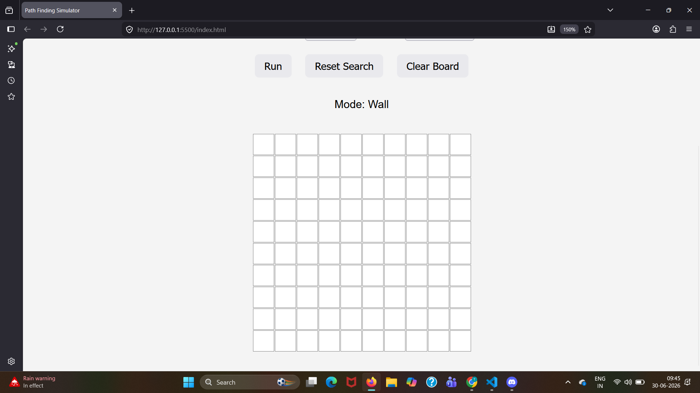
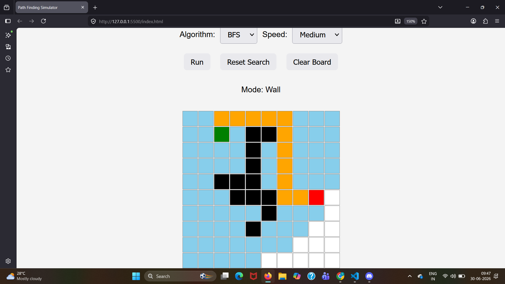
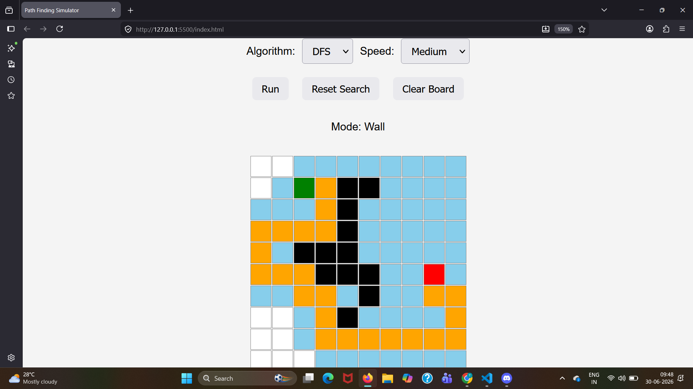

# Path Finding Simulator

An interactive Path Finding Simulator built using HTML, CSS, and JavaScript. This project visualizes graph traversal algorithms on a 10×10 grid with animated execution.An interactive visualization tool for understanding Breadth-First Search (BFS) and Depth-First Search (DFS). Users can create obstacles, choose algorithms, and observe how paths are explored and reconstructed step by step.

---

## Features

- Interactive 10×10 grid
- Place Start node
- Place End node
- Draw walls by clicking or dragging
- Breadth First Search (BFS)
- Depth First Search (DFS)
- Animated search visualization
- Animated path reconstruction
- Speed selection
- Algorithm selection
- Reset Search
- Clear Board

---

## Technologies Used

- HTML
- CSS
- JavaScript

---

## How to Run

1. Clone or download this repository.
2. Open `index.html` in your browser.
3. Select an algorithm.
4. Place Start and End nodes.
5. Draw walls.
6. Click **Run** to visualize the algorithm.

---

## Future Improvements

- Dijkstra's Algorithm
- A* Search
- Maze Generation
- Adjustable Grid Size
- Weighted Nodes

---

## Author

Tannistha Saha

## Screenshots

### Home

### BFS

### DFS

